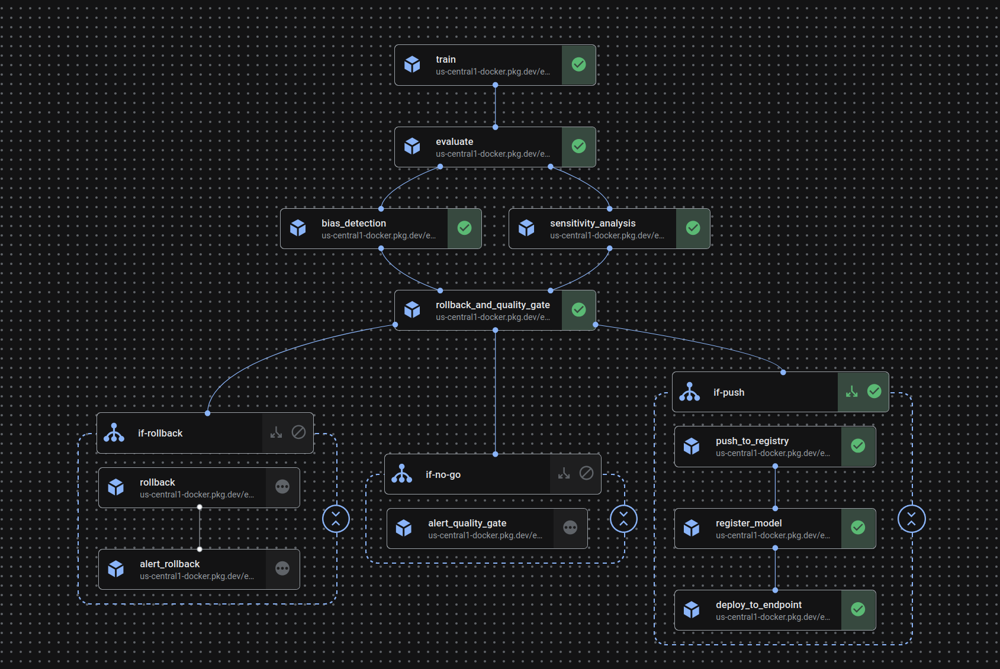

# Entity Resolution — Model Pipeline

### Stage 1 — Pairwise Matching (DeBERTa)

A language model (DeBERTa-v3-base) is fine-tuned to compare pairs of records and output a match probability between 0 and 1. A score above 0.45 means the records likely refer to the same person.

The model is trained on labelled pairs of records and learns patterns like:
- "Mike J Green" and "Michael Greene" are likely the same name
- Same address with different formatting counts as a match signal
- Missing fields are treated as unknown, not as non-matching

### Stage 2 — Graph Resolution (GraphSAGE) *(coming)*

Some records only link through a third record — Record 1 matches Record 3, and Record 3 matches Record 2, but Records 1 and 2 don't directly match. A graph neural network resolves these transitive connections into final entity clusters.

---

## Pipeline Architecture

```
New data arrives
        ↓
Data Pipeline (Airflow) — cleans and stores records in GCS
        ↓
Model Pipeline (Vertex AI) — trains and deploys the model
        ↓
Inference Pipeline (Vertex AI) — scores new pairs, builds clusters
        ↓
Results stored in BigQuery
```

### Model Pipeline Steps

```
1. Train        Fine-tune DeBERTa+LoRA on labelled record pairs (~44 min, GPU)
2. Evaluate     Score the model on held-out test data
3. Bias Check   Verify the model performs equally across data sources
4. Sensitivity  Measure which fields (name, address) matter most
5. Rollback     Compare against previous best model — revert if worse
6. Quality Gate Check F1, precision, recall, AUC against minimum thresholds
7. Push         Build a serving Docker image with the trained weights
8. Register     Register the image in Vertex AI Model Registry
9. Deploy       Deploy to a live prediction endpoint
```

---

## Infrastructure

| Component | Technology |
|---|---|
| Orchestration | Vertex AI Pipelines (KFP v2) |
| Training compute | Vertex AI Custom Job (ephemeral GPU VM) |
| Model serving | Vertex AI Endpoint |
| Experiment tracking | MLflow |
| Container registry | GCP Artifact Registry |
| Storage | Google Cloud Storage + BigQuery |
| CI/CD | GitHub Actions |

---

## Repository Structure

```
Entity-Resolution/
├── Data-Pipeline/          Airflow DAGs for data ingestion
└── Model-Pipeline/
    ├── scripts/
    │   ├── train.py            DeBERTa+LoRA fine-tuning
    │   ├── evaluate.py         Test set evaluation
    │   ├── bias_detection.py   Fairness slicing by data source
    │   ├── sensitivity_analysis.py   Field importance (SHAP masking)
    │   ├── push_to_registry.py Build + push serving Docker image
    │   └── serve.py            FastAPI prediction server
    ├── pipeline.py         Vertex AI Pipeline definition (KFP v2)
    ├── config/
    │   └── training_config.yaml
    └── Dockerfile
```

---

## Running the Pipeline

**One-time setup:**
```bash
# Write MLflow URI to GCS (run once, or after VM restart)
echo "http://$(curl -s http://metadata.google.internal/computeMetadata/v1/instance/network-interfaces/0/access-configs/0/external-ip -H 'Metadata-Flavor: Google'):5000" | \
  gcloud storage cp - gs://entity-resolution-bucket-1/config/mlflow_uri.txt

# Start MLflow
docker compose up -d mlflow
```

**Submitting a training run:**
```bash
docker compose run --rm trainer python pipeline.py --run
```

**Monitoring:**
```
https://console.cloud.google.com/vertex-ai/pipelines?project=entity-resolution-487121
```

**Viewing results:**
```
http://<VM-IP>:5000
```

### Training Flow



---

## Prediction API

Once deployed, the endpoint accepts:

```json
POST /predict
{
  "instances": [
    {
      "name1": "Robert Smith",
      "address1": "123 Main Street",
      "name2": "Bob Smith",
      "address2": "123 Main St"
    }
  ]
}
```

Response:
```json
{
  "predictions": [
    {
      "match": true,
      "probability": 0.99888938665390015
    }
  ]
}
```

